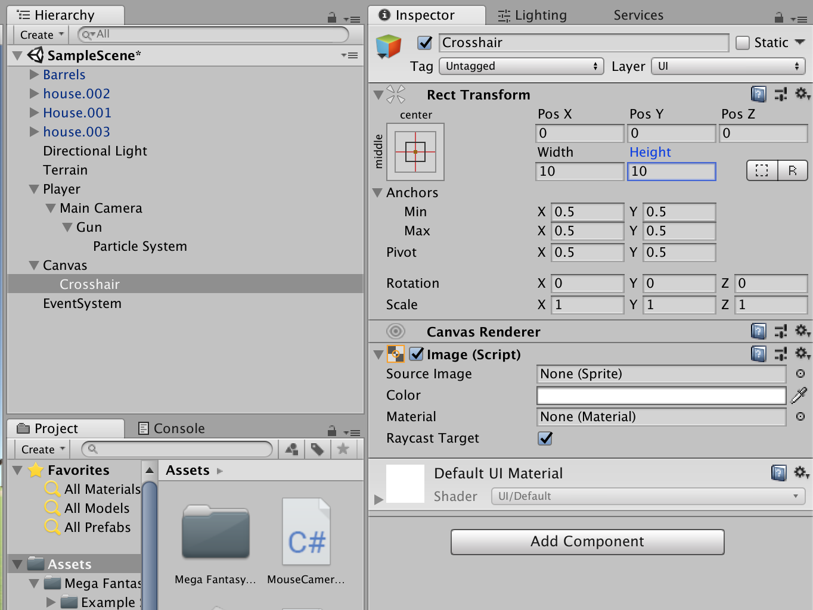

# Unity VR First Person Shooter

## Creating Terrain

1.  Open Unity and create a new project called `YourName-Unity-VR-FPS`
2.  Go into the Assets store and search and download **Mega Fantasy Props Pack**. After the download is complete, click import.
3.  Create a new Terrain by right-clicking in the Hierarchy window then select `3D Object > Terrain`
4.  Change the Terrain Width and Terrain Length of the terrain to 200:
    
5.  Under the Terrain component, we select the paintbrush from the tool bar to paint the texture.
6.  Add the `grass_1_fixed_d` texture. You can do this by searching for `grass_1_fixed_d` in the Assets folder located in the Project window. Set the x and y size of the terrain to 1
7.  Add another texture called `Dirt_1_fixed_d`
8.  Select the dirt texture and the biggest brush to add a dirt patch. This is where we will put our buildings.
    

## Adding Buildings

1.  Click on the `Mega Fantasy Props Pack` folder. Add buildings or props from the `Prefab` folder. Be creative!

## Setting Up Our Character

**NOTE: Because this is a VR game, the MAIN CAMERA will be our player**

1.  Go into the Hierarchy window and create an empty game object **make sure nothing is highlighted in the Hierarchy window before you add the empty object!**. Right click and select `Create Empty`. Rename it `Player` then we’ll make our main camera a child of player.
2.  From the Hierarchy window, drag the `Main Camera` into the `Player` so that Main Camera becomes the **child** of Player. Your Hierarchy should look like:
    
3.  Set the `Main Camera` position to (0, 1, 0) and the `Player` position to be (5, 1, 5)
4.  Add a `Capsule Collider` component to the `Player` game object and set the height to 2
5.  Attach a `RigidBody` component to `Player`
6.  Make sure the `Player` game object is highlighted. Next, create a new script called `PlayerController`. Delete everything in the script and add the following:

```
using System.Collections;
using System.Collections.Generic;
using UnityEngine;

public class PlayerController : MonoBehaviour {

   public float Speed = 3f;

   private Vector3 _movement;
   private Rigidbody _playerRigidBody;

   private void Awake()
   {
       _playerRigidBody = GetComponent<Rigidbody>();
   }


   private void FixedUpdate()
   {
       float horizontal = Input.GetAxisRaw("Horizontal");
       float vertical = Input.GetAxisRaw("Vertical");

       Move(horizontal, vertical);
   }

   private void Move(float horizontal, float vertical)
   {
       _movement = (vertical * transform.forward) + (horizontal * transform.right);
       _movement = _movement.normalized * Speed * Time.deltaTime;
       _playerRigidBody.MovePosition(transform.position + _movement);
   }
}
```

## Rotating Camera

1.  In the Hierarchy window, select `Main Camera` and add a new script component called `MouseCameraController` delete everything and add the following:

```
using System.Collections;
using System.Collections.Generic;
using UnityEngine;

public class MouseCameraController : MonoBehaviour {
	public float Sensitivity = 5.0f;
	public float Smoothing = 2.0f;

	private Vector2 _mouseLook;
	private Vector2 _smoothV;

	private GameObject _player;

	void Awake () {
		_player = transform.parent.gameObject;
	}

	// Update is called once per frame
	void Update () {
		Vector2 mouseDirection = new Vector2 (Input.GetAxisRaw ("Mouse X"), Input.GetAxisRaw ("Mouse Y"));

		mouseDirection.x *= Sensitivity * Smoothing;
		mouseDirection.y *= Sensitivity * Smoothing;

		_smoothV.x = Mathf.Lerp (_smoothV.x, mouseDirection.x, 1f / Smoothing);
		_smoothV.y = Mathf.Lerp (_smoothV.y, mouseDirection.y, 1f / Smoothing);

		_mouseLook += _smoothV;
		_mouseLook.y = Mathf.Clamp (_mouseLook.y, -90, 90);

		transform.localRotation = Quaternion.AngleAxis (-_mouseLook.y, Vector3.right);
		_player.transform.rotation = Quaternion.AngleAxis (_mouseLook.x, _player.transform.up);
	}
}
```

## Setting Up A Weapon

1.  In the Hierarchy window, select `Main Camera`. Next, create a `Cube` 3D Object and rename it to `Gun`
2.  Change the `Position` to (0.25, -0.5, 1) and the `Scale` to (0, 0.25, .5)
3.  In the `Inspector` window remove the `Box Collider` component from the `Gun` game object. Your window should look like the following:
    
4.  Select `Gun` next, right click and select `Effects > Particle System`
5.  Change the `Particle System` configurations to:

- Duration: 1
- Looping: unchecked
- Start Lifetime: 0.05
- Start Speed: 5
- Start Size: 1
- Start Color: Yellow
- Play Awake: unchecked

6.  In the `Hierarchy` window select `Main Camera` and create a new script called `PlayerShootingController` delete everything and replace with:

```
using System.Collections;
using System.Collections.Generic;
using UnityEngine;

public class PlayerShootingController : MonoBehaviour {
	public float Range = 100;

	private Camera _camera;
	private ParticleSystem _particle;

	void Start () {
        _camera = Camera.main;
        _particle = GetComponentInChildren<ParticleSystem>();
        Cursor.lockState = CursorLockMode.Locked;
}

	void Update () {

		if (Input.GetMouseButton (0)) {
			Ray ray = _camera.ScreenPointToRay (Input.mousePosition);
			RaycastHit hit = new RaycastHit ();

			if (Physics.Raycast (ray, out hit, Range)) {
				print ("hit " + hit.collider.gameObject);

				_particle.Play ();
			}
		}
	}
}
```

7.  In the `Hierarchy` window, make sure everything is deselected. Next, right-click and select `UI > Image`. Rename the image to `Crosshair`
8.  In the `Inspector` window change the Width and Height to 10. You should now have something that looks like:
    
9.  Select `Canvas` and add a `Canvas Group` from the `Inspector` window. Deselect `Interactable` and `Blocks Raycasts`

## Creating An Enemy

1.  In the `Hierarchy` window, make sure everything is deselected. Next, create a new `Cube` 3D Object. Rename it to `Enemy`.
2.  With `Enemy` selected in the `Hierarchy` window, create a new script called `EnemyHealth`. Delete everything and replace with:

```
using System.Collections;
using System.Collections.Generic;
using UnityEngine;

public class EnemyHealth : MonoBehaviour {
	public float Health = 10;

	public void TakeDamage (float damage) {
		Health -= damage;
		if (Health == 0) {
			Destroy (gameObject);
		}
	}
}
```

3.  With the `Enemy` object selected in the `Hierarchy` window. Go to the `Inspector` window and find the `Layer` drop down and add a new layer called `Shootable`.
    Your window should now look like the following:
    
4.  Go back to the `PlayerShootingController` script and replace the code with the following:

```
using System.Collections;
using System.Collections.Generic;
using UnityEngine;

public class PlayerShootingController : MonoBehaviour {
	public float Range = 100;

	private Camera _camera;
	private ParticleSystem _particle;
	private LayerMask _shootableMask;

	void Start () {
		_camera = Camera.main;
		_particle = GetComponentInChildren<ParticleSystem> ();
		Cursor.lockState = CursorLockMode.Locked;
		_shootableMask = LayerMask.GetMask ("Shootable");
	}

	void Update () {
		if (Input.GetMouseButton (0)) {
			Ray ray = _camera.ScreenPointToRay (Input.mousePosition);
			RaycastHit hit = new RaycastHit ();

			if (Physics.Raycast (ray, out hit, Range, _shootableMask)) {
				print ("hit " + hit.collider.gameObject);
				_particle.Play ();

				EnemyHealth health = hit.collider.GetComponent<EnemyHealth> ();
				if (health != null) {
					health.TakeDamage (1);
				}
			}
		}
	}
}
```

5.  **WHEN YOU GET TO THIS STEP CALL OVER AN INSTRUCTOR TO HELP YOU DOWNLOAD THE `Mecanim Warrior Anim` FOLDER FROM THIS REPOSITORY**
6.  From the `Assets Store` search for `Warrior Pack Bundle 1` and `Strong Knight` download and import.
7.  In the `Project` window, deselect everything, then create a new folder called `Animation`
8.  Right click the `Animation` folder and select `Create > Animation Controller`. Rename the Animation Controller to `Knight Controller`
9. Create 3 parameters: bool: `IsPlayerNear`, trigger: `Death`, trigger: `Idle`
10.  Drag the following animations into `Animation Controller`:

- death from Mecanim Warrior
- Attack1 from Brute Warrior Mecanim
- Idle from Brute Warrior Mecanim
- Run from Brute Warrior Mecanim

11. **WHEN YOU GET TO THIS STEP CALL OVER AN INSTRUCTOR TO HELP YOU WITH THE ANIMATIONS** Your animation flow should look like. Right click on the button and select `Make Transition`. To create conditions click the arrow and a screen will appear in the `Inspector` window to create conditions:
	* Run => Attack (IsPlayerNear = true)
	* Attack => Run (IsPlayerNear = false)
	* Any State => Idle (Idle)
	* Any State => Death (Death)
    
12. Drag the `Knight` from the prefabs folder into the Scene. Next, drag the `Knight Animation` to the `Knight` object in the `Hierarchy` window.
13. Add a `Nav Mesh Agent` component to the `Knight`
14. Open up the Navigation window by going to the top of the screen where File, Edit, Selection, Etc is located. Select `Window > Navigation`. The Navigation window will pop up in the same area as `Inspector`
15. In the `Bake` hit the `Bake` Button
    
16. With the `Knight` selected in the Hierarchy window, create a new script called `EnemyMovement`. Delete and replace the script with the following:

```
using System.Collections;
using System.Collections.Generic;
using UnityEngine;
using UnityEngine.AI;

public class EnemyMovement : MonoBehaviour {
	private NavMeshAgent _nav;
	private Transform _player;

	void Start () {
		_nav = GetComponent<NavMeshAgent> ();
		_player = GameObject.FindGameObjectWithTag ("Player").transform;
	}

	void Update () {
		_nav.SetDestination (_player.position);
	}
}
```

16. Click on `Player` in the `Hierarchy` window and change the Tag in the `Inspector` window to `Player`
17. Add a `Capsule Collider` component to the `Knight` game object and change these settings:

- Is Trigger is checked
- Y Center is 1
- Y Radius is 1.5
- Y Height is 1
  Your screen should look like:
  

18. Select the `Knight` in the Hierarchy window. Next, create a new script called `EnemyAttack`. Delete and replace with the following script:

```
using System.Collections;
using System.Collections.Generic;
using UnityEngine;

public class EnemyAttack : MonoBehaviour {
	Animator _animator;
	GameObject _player;

	void Awake () {
		_player = GameObject.FindGameObjectWithTag ("Player");
		_animator = GetComponent<Animator> ();
	}

	void OnTriggerEnter (Collider other) {
		if (other.gameObject == _player) {
			_animator.SetBool ("IsNearPlayer", true);
		}
	}

	void OnTriggerExit (Collider other) {
		if (other.gameObject == _player) {
			_animator.SetBool ("IsNearPlayer", false);
		}
	}
}
```

**Note: If the Knight stops attacking after the first time, check the attack animation clip and make sure Loop Time is checked.**


19. Add a `Mesh Collider` component to the `Knight` game object.
20. Attach the `body` mesh that our Knight uses to the `Mesh Collider`
    
21. Click on `Attack1` in the `Animator` and the select the `Animation` tab to open it
22. Duplicate the `Attack1` by typing `cmd+d` and rename it to `Knight Attack`. Next, drag `Knight Attack` into the `Animation` folder.
23. Back in the `Animator` tab for the Knight Animator Controller, switch the `Attack1` state to use the new `Knight Attack` animation clip instead of the previous one.
24. In the `EnemyAttack` script replace with the following:

```
using System.Collections;
using System.Collections.Generic;
using UnityEngine;

public class EnemyAttack : MonoBehaviour {
	private Animator _animator;
	private GameObject _player;
	private bool _collidedWithPlayer;

	void Awake () {
		_player = GameObject.FindGameObjectWithTag ("Player");
		_animator = GetComponent<Animator> ();
	}

	void OnTriggerEnter (Collider other) {
		if (other.gameObject == _player) {
			_animator.SetBool ("IsNearPlayer", true);
		}
		print ("enter trigger with _player");
	}

	void OnCollisionEnter (Collision other) {
		if (other.gameObject == _player) {
			_collidedWithPlayer = true;
		}
		print ("enter collided with _player");
	}

	void OnCollisionExit (Collision other) {
		if (other.gameObject == _player) {
			_collidedWithPlayer = false;
		}
		print ("exit collided with _player");
	}

	void OnTriggerExit (Collider other) {
		if (other.gameObject == _player) {
			_animator.SetBool ("IsNearPlayer", false);
		}
		print ("exit trigger with _player");
	}

	void Attack () {
		if (_collidedWithPlayer) {
			print ("player has been hit");
		}
	}
}
```

## Attacking Enemies & Health System

1.  Select `Player` from the `Hierarchy` window and change change `Drag` in the `Inspector` window to 5.
2.  Drag the `EnemyHealth` script to `Knight` in the `Hierarchy` window, Next, open the script and replace with the following:

```
using System.Collections;
using System.Collections.Generic;
using UnityEngine;

public class EnemyHealth : MonoBehaviour {
	public float Health = 10;

	private Animator _animator;

	void Start () {
		_animator = GetComponent<Animator> ();
	}

	public void TakeDamage (float damage) {
		if (Health <= 0) {
			return;
		}

		Health -= damage;
		if (Health <= 0) {
			Death ();
		}
	}

	private void Death () {
		_animator.SetTrigger ("Death");
	}
}
```

3.  In the `EnemyMovement` script replace with the following:

```
public class EnemyMovement : MonoBehaviour
{
    private NavMeshAgent _nav;
    private Transform _player;
    private EnemyHealth _enemyHealth;

    void Start ()
    {
        _nav = GetComponent<NavMeshAgent>();
        _player = GameObject.FindGameObjectWithTag("Player").transform;
        _enemyHealth = GetComponent<EnemyHealth>();
    }

    void Update ()
    {
        if (_enemyHealth.Health > 0)
        {
            _nav.SetDestination(_player.position);
        }
        else
        {
            _nav.enabled = false;
        }
    }
}
```
